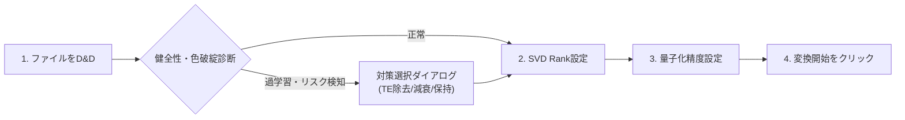

# SDXL Model & LoRA Quantizer & Rank Resizer

**日本語** | [English](README_EN.md) | [简体中文](README_ZH.md)

[](https://www.python.org/)
[](https://riverbankcomputing.com/software/pyqt/)
[](https://pytorch.org/)
[](LICENSE)
[](https://www.microsoft.com/windows)

**SDXL Model & LoRA Quantizer & Rank Resizer** は、Stable Diffusion XL (SDXL) や最新の生成AIモデル（Checkpoints / LoRA）を対象に、**SVD (特異値分解) によるランク削減** と **高効率量子化 (FP8 / INT8 / INT4 / NVFP4 / GGUF)** を組み合わせてモデルサイズを極限まで軽量化するデスクトップGUIアプリケーションです。

<p align="center">
  
</p>

---

## 🌟 主な特長

### 1. SVD Rank リサイズ (特異値分解)
- 大容量LoRA（Rank 128 / 64等）の冗長なパラメータを特異値分解によって切り捨て、表現力を損なわずにサイズを大幅削減。
- **Alpha比例スケーリング補正**:
  $$\text{新 Alpha} = \text{元 Alpha} \times \frac{\text{新 Rank}}{\text{元 Rank}}$$
  リサイズ時に実効スケール比（$\alpha / \text{rank}$）を100%維持することで、SD-WebUIやComfyUIで読み込んだ際に画像が真っ黒（Black Screen）になる現象や画質破綻を完全防止。
- 学習メタデータ（`ss_network_dim`, `ss_network_alpha` 等）の自動更新・継承。

### 2. 多彩な量子化フォーマット
お使いのGPU世代や利用環境（WebUI / Forge / ComfyUI）に合わせて最適な精度を選択できます。

| 形式 | 削減率 | 推奨環境 | 特長・用途 |
| :--- | :---: | :--- | :--- |
| **FP8 (e4m3fn)** | 約 50% | RTX 40xx / 50xx | **【推奨・高品質】** 画質劣化が極めて少なく、Forge / ComfyUI が標準ネイティブ対応 |
| **FP8 (e5m2)** | 約 50% | RTX 40xx / 50xx | 広ダイナミックレンジ。オーバーフローを防ぐ8bit浮動小数点 |
| **INT8** | 約 50% | RTX 20xx〜50xx 全世代 | Turing/Ampere/Ada世代に広く対応した汎用8bit整数量子化 |
| **INT4 / NF4** | 約 75% | 低VRAM環境 | メモリ消費を最小限に抑えたい場合に特化した汎用4bit量子化（ComfyUI-NF4対応） |
| **NVFP4 / FP4** | 約 75% | RTX 50xx (Blackwell) | Blackwell世代のハードウェアアクセラレーションに対応したネイティブ4bit Float |
| **FP16** | 約 50% ※ | 全GPU / CPU | 全環境完全互換の標準16bit浮動小数点（FP32モデルの軽量化に有効） |
| **GGUF (Q4_K_M)** | 約 70% | 全GPU / CPU | ComfyUI-GGUF ノードや sd.cpp で直接読み込み可能な高効率形式 |
| **元精度維持** | - | 全環境 | 量子化を行わず、SVDランク削減のみを実行（BF16/FP16維持） |

※ FP32元ファイルからの削減率  
※ **注意**: 作者は RTX 50xx シリーズの実機を所持していないため、実機での動作テストは行っていません（動作報告やフィードバックを歓迎します！）。

### 3. VAE 自動保護フィルタ
- チェックポイントモデル内の VAE テンソル（`first_stage_model` 等）を自動検出し、FP16/FP32精度を厳格に保持。量子化による潜在空間のデコード破綻を防止します。

### 4. 低VRAMストリーミング変換
- 6GB超の大型モデルでも一括でVRAMに展開せず、テンソル単位で順次GPUに転送・演算・CPU回収を行います。
- **VRAM 6GB〜8GBクラスの一般的なGPU環境でも、CUDA Out of Memory (OOM) を起こすことなく安全にバッチ処理が可能**です。

### 5. 多言語対応 (i18n: 日本語 / English / 简体中文)
- 起動時に `lang/` ディレクトリ内の言語定義ファイルを動的スキャン。
- 画面右上の言語セレクターからいつでもワンクリックで言語を切り替え可能（アプリの再起動不要）。
- **新しい言語の追加手順**:
  1. `lang/en.json`（または `lang/ja.json`）をコピーし、ファイル名を目的の言語コード（例: 韓国語なら `ko.json`、フランス語なら `fr.json`、スペイン語なら `es.json`）に変更します。
  2. JSON 内の `"language_name"` をセレクターに表示したい言語名（例: `"한국어"`）に変更し、各テキストを翻訳します。
  3. アプリを起動すると、言語セレクターに新しい言語が自動的に追加されます（プログラムの修正や再コンパイルは一切不要です）。
  *(※ 未翻訳のキーがある場合でもアプリがクラッシュすることはなく、`[MISSING: キー名]` として安全にフォールバック表示されます)*

### 6. プレビュー画像 & メタデータ同期
- モデルファイルと同階層にあるプレビュー画像（`.png`, `.jpg`, `.webp`）を変換後のファイル名に合わせて自動リネームコピー。
- **[ComfyUI-Lora-Manager](https://github.com/willmiao/ComfyUI-Lora-Manager) 対応**:
  人気拡張機能 ComfyUI-Lora-Manager に対応しており、関連する JSON ファイル（`*.metadata.json`）内のモデルファイル名、新 Rank、新 Alpha、量子化タグ、変換履歴を自動修正・同期出力します。

### 7. 破損ファイル自動検知 & 整合性ベリファイ
- ドラッグ＆ドロップ時にヘッダーを事前スキャンし、破損ファイルや空ファイルを赤文字・太字で強調表示し、変換対象から自動除外。
- 変換直後に「全キー一致」「Shape一致」「NaN/Inf異常値」を自動ベリファイ。万一破損を検知した場合は出力ファイルを安全のため即座に物理削除。

### 8. LoRA健全性診断 & 過学習・色破綻 (CLIP過学習) 自動防止
- ドラッグ＆ドロップ時にファイルの内部構造や学習メタデータを高速診断し、**「過剰リピートによる構図・ポーズ破綻」**や、WebUI等で生成した際に**「全体が極彩色・白飛び・ネガポジ反転・黒潰れ」**を起こす色破綻リスク、計算異常値を自動検知。
- **検知内容**:
  - **過学習・丸暗記検知**: 少数画像（〜200枚程度）に対する過剰なリピート学習（`n_repeats >= 30` や `steps / img >= 30`）や過大なRank次元（`network_dim >= 64`）による構図破綻リスク
  - **Text Encoder (CLIP-L / CLIP-G) 過学習**: 超高学習率（`2e-4` 等）や重み変化量の突出（`> 0.20`、UNet比2倍以上）によるプロンプト解釈の暴走
  - **特殊ベースモデル不整合**: `NoobAI-XL Epsilon` や `V-Prediction` 等の特殊ベースモデルによる色崩れ
  - **テンソル破損**: NaN（非数）/ Inf（無限大）の計算破綻値
- **学習パラメータのGUI可視化**:
  - メイン画面のインスペクターカードおよびテーブルツールチップに、**「学習画像枚数」「繰り返し回数 (n_repeats)」「学習Rank」「総ステップ数」**を分かりやすく表示。
- **対策選択ダイアログ (`LoRAHealthDialog`) & GUI常設オプション**:
  - **GUI設定パネル常設チェックボックス**: 「Text Encoder を除去 (UNet のみにクリーンアップ)」を常設。いつでもワンクリックでTE除去変換を呼び出し可能。
  - **【推奨】Text Encoder 除去 (`_clean_unet`)**: 過学習や色破綻の原因となる CLIP 重みを完全除去し、造形・ポーズ（UNet）のみを正常適用（ファイルサイズも約 25%〜35% 大幅軽量化）。
  - **Text Encoder 強度減衰 (`_te_scaled`)**: TE 重みを 0.2 倍にスケール低減して色調・構図崩壊を抑制。
  - **SVD Rank 圧縮**: Rank 32〜64 程度に圧縮して過学習成分を削ぎ落とす対策の提示。
  - ※元ファイルは読み取り専用で検査されるため、**元のLoRAファイルが編集・上書きされることは一切ありません（完全非破壊）**。

---

## 🖥️ 動作環境

- **OS**: Windows 10 / 11 (64-bit)
- **GPU**: NVIDIA GeForce RTX 20xx / 30xx / 40xx / 50xx シリーズ（CUDA 11.8 または 12.x 対応ドライバ）  
  *(※ 作者は RTX 50xx を所持していないため、50xx でのテストは行っていません)*
- **Python**: 3.10 または 3.11
- **必須ライブラリ**: PyTorch, PyQt6, safetensors（セットアップバッチで自動インストールされます）

---

## 🚀 インストール & 起動方法

### ステップ 1: リポジトリのクローン
```bash
git clone https://github.com/Zaki-XL/SDXL-Lora-Resize.git
cd SDXL-Lora-Resize
```

### ステップ 2: 環境セットアップ (初回のみ)
リポジトリ直下の `setup_env.bat` をダブルクリックして実行します。
Python 仮想環境（`.venv`）が自動作成され、必要な依存パッケージ（PyTorch, PyQt6等）のインストールおよびランチャー（`SDXL_Quantizer.exe`）の自動生成が一括で行われます。

```bash
setup_env.bat
```

### ステップ 3: アプリケーションの起動
以下のいずれかの方法で起動できます。

- **`SDXL_Quantizer.exe`** をダブルクリック（二重起動防止機能付きランチャー）
- または **`run.bat`** をダブルクリック

> [!NOTE]
> 設定ファイル `config.ini` は初回起動時に自動生成されます。Git リポジトリから明示的に除外されているため、初期設定のクリーンな状態で開始できます。

---

## 📖 使い方



1. **ファイルの追加**:
   - 変換したい `.safetensors` ファイル（LoRA または Checkpoint）を画面上部の点線エリアにドラッグ＆ドロップします（または「＋ ファイル選択」ボタンから選択）。
   - **健全性・色破綻診断**: CLIP過学習や特殊ベースモデル（NoobAI-XL Epsilon等）による色破綻リスクが検知された場合、確認ダイアログが表示されます。推奨対策（Text Encoder除去等）を選択してください。
2. **SVD Rank削減設定**:
   - 目的のRank（例: `Target Rank 32`、`Target Rank 16`、`リサイズなし` など）を選択します。
3. **量子化精度設定**:
   - 変換形式（例: `FP8 (e4m3fn)`、`INT8`、`INT4/NF4` など）を選択します。
   - お使いの環境に合わせて「VAEを保護 (FP16維持)」「同名ファイルは強制上書き」にチェックを入れます。
4. **保存先フォルダ**:
   - デフォルトでは元ファイルと同じ階層に出力されます。「変更...」ボタンで任意の出力フォルダを指定することも可能です。
5. **変換の実行**:
   - **「🚀 リサイズ & 量子化変換を開始」** ボタンをクリックします。
   - リアルタイム進捗バーとコンソールログに処理速度（MB/s）が表示されます。

---

## 📁 ディレクトリ構成

```text
SDXL-Lora-Resize/
├── .gitignore               # Git 除外設定 (.venv, config.ini, モデル等を除外)
├── assets/                  # アプリアイコン・画像リソース
├── doc/                     # 開発・品質監査ドキュメント
│   └── reviewer_report.md   # 品質・セキュリティ・検証結果レビュー報告書
├── lang/                    # 多言語リソース辞書 (JSON)
│   ├── ja.json              # 日本語
│   ├── en.json              # 英語 (English)
│   └── zh.json              # 簡体字中国語 (简体中文)
├── src/
│   ├── main.py              # アプリケーションエントリポイント
│   ├── gui/                 # PyQt6 GUI 実装 & ワーカースレッド & 診断ダイアログ
│   ├── quantizer/           # SVDリサイズ & 量子化 & 健全性診断コアロジック
│   └── utils/               # i18n, GPU判定, Safetensors I/O, 設定管理
├── tests/                   # 自動単体テストスイート
├── Launcher.cs              # C# 製二重起動防止ランチャーソースコード
├── build_launcher.bat       # ランチャー単体ビルド用バッチ
├── setup_env.bat            # 仮想環境構築 & ランチャー自動生成バッチ
├── run.bat                  # 直接起動用バッチ
├── requirements.txt         # 依存パッケージ定義
├── LICENSE                  # MIT ライセンス定義書
├── README.md                # 日本語ドキュメント (本文書)
├── README_EN.md             # 英語ドキュメント (English)
└── README_ZH.md             # 簡体字中国語ドキュメント (简体中文)
```

---

## 📚 関連ドキュメント
- [品質・セキュリティ監査報告書 (doc/reviewer_report.md)](doc/reviewer_report.md): アーキテクチャ評価、パフォーマンス測定結果、SVDスケーリング検証、および自動テスト全21件の合格記録。

---

## 🧪 テストの実行

プロジェクト内の単体テストを実行するには、以下のコマンドを実行します。

```bash
.venv\Scripts\python.exe -m unittest discover -s tests -p "test_*.py"
```

---

## 📄 ライセンス

本プロジェクトのソースコードは [MIT License](LICENSE) の下で公開されています。  
※ 本ツールが依存している GUI ライブラリ PyQt6 には GNU GPL v3 が適用されます。

---

## 🤝 免責事項

- 本ツールによって生成されたモデルファイルの使用および配布は、元モデルのライセンス条件（CreativeML Open RAIL++-M、OpenRAIL-M 等）に準拠してください。
- 変換処理を行う際は、重要な元ファイルのバックアップをあらかじめ取得しておくことを推奨いたします。
