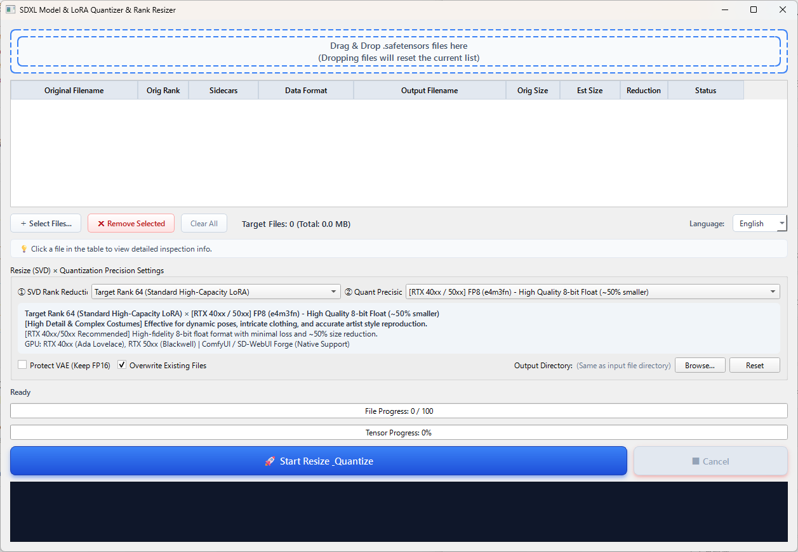

# SDXL Model & LoRA Quantizer & Rank Resizer

[日本語](README.md) | **English** | [简体中文](README_ZH.md)

[](https://www.python.org/)
[](https://riverbankcomputing.com/software/pyqt/)
[](https://pytorch.org/)
[](LICENSE)
[](https://www.microsoft.com/windows)

**SDXL Model & LoRA Quantizer & Rank Resizer** is a standalone desktop GUI application designed for Stable Diffusion XL (SDXL) and modern generative AI models (Checkpoints / LoRA). It dramatically reduces model file size by combining **SVD (Singular Value Decomposition) Rank Reduction** with **high-efficiency Quantization (FP8 / INT8 / INT4 / NVFP4 / GGUF)**.

<p align="center">
  
</p>

---

## 🌟 Key Features

### 1. SVD Rank Resizing (Singular Value Decomposition)
- Decomposes redundant parameters in high-rank LoRAs (Rank 128 / 64, etc.) to drastically reduce file size while preserving expressive power and art style.
- **Proportional Alpha Scaling Correction**:
  $$\text{New Alpha} = \text{Original Alpha} \times \frac{\text{Target Rank}}{\text{Original Rank}}$$
  Automatically maintains 100% of the effective scale ratio ($\alpha / \text{rank}$), completely eliminating the black screen bug and image breakdown when loaded in SD-WebUI or ComfyUI.
- Automatically preserves and updates training metadata (`ss_network_dim`, `ss_network_alpha`, etc.).

### 2. Versatile Quantization Formats
Choose the optimal precision for your GPU architecture and target environment (WebUI / Forge / ComfyUI).

| Format | Size Reduction | Recommended Hardware | Highlights & Compatibility |
| :--- | :---: | :--- | :--- |
| **FP8 (e4m3fn)** | ~50% | RTX 40xx / 50xx | **[Recommended / High Quality]** Minimal quality loss. Native support in Forge and ComfyUI. |
| **FP8 (e5m2)** | ~50% | RTX 40xx / 50xx | Wide dynamic range 8-bit float. Prevents numeric overflow. |
| **INT8** | ~50% | All RTX (20xx-50xx) | Universal 8-bit integer quantization across Turing, Ampere, and Ada architectures. |
| **INT4 / NF4** | ~75% | Ultra Low VRAM | Maximum memory savings for low-VRAM GPUs (ComfyUI-NF4 supported). |
| **NVFP4 / FP4** | ~75% | RTX 50xx (Blackwell) | Native 4-bit floating point acceleration for next-gen Blackwell GPUs. |
| **FP16** | ~50% * | All GPUs / CPUs | Universal standard 16-bit float format (ideal for converting FP32 models). |
| **GGUF (Q4_K_M)** | ~70% | All GPUs / CPUs | High-efficiency format directly readable by ComfyUI-GGUF and sd.cpp nodes. |
| **Keep Original** | - | All Environments | Retains original precision (BF16/FP16) while performing SVD rank reduction only. |

\* *Reduction rate compared to FP32 source file.*  
\* **Note**: The author does not own an RTX 50-series GPU, so testing on RTX 50xx hardware has not been conducted (community feedback and testing reports are very welcome!).

### 3. Automatic VAE Protection Filter
- Automatically detects VAE tensors (`first_stage_model`, etc.) inside checkpoint models and strictly preserves FP16/FP32 precision, preventing latent decoding breakdown and black images.

### 4. Low-VRAM Streaming Conversion
- Instead of loading huge 6GB+ models entirely into GPU memory, tensors are transferred, computed, and reclaimed sequentially on CPU/GPU.
- **Safe batch processing even on entry-level GPUs with 6GB to 8GB VRAM without encountering CUDA Out of Memory (OOM) errors.**

### 5. Multilingual Support (i18n: 日本語 / English / 简体中文)
- Dynamically scans the `lang/` directory on startup.
- Instantly switch languages via the dropdown selector in the UI without restarting the application.
- Easily add new languages simply by dropping a JSON file (e.g., `ko.json`) into the `lang/` directory.

### 6. Sidecar Images & Metadata Synchronization
- Automatically copies and renames associated preview images (`.png`, `.jpg`, `.webp`) to match the new output model name.
- **[ComfyUI-Lora-Manager](https://github.com/willmiao/ComfyUI-Lora-Manager) Support**:
  Full compatibility with the popular ComfyUI-Lora-Manager extension. Automatically modifies and synchronizes model filenames, new Rank, new Alpha, quantization tags, and conversion history inside the corresponding `*.metadata.json` sidecar files.

### 7. File Corruption Detection & Automatic Integrity Verification
- Automatically inspects safetensors headers during drag & drop, highlighting corrupt or 0-byte files in bold red and safely excluding them from processing.
- Automatically verifies key count, tensor shapes, and checks for NaN/Inf anomalies immediately after conversion. Corrupt files are automatically deleted for safety.

---

## 🖥️ System Requirements

- **OS**: Windows 10 / 11 (64-bit)
- **GPU**: NVIDIA GeForce RTX 20xx / 30xx / 40xx / 50xx series (CUDA 11.8 or 12.x compatible driver)  
  *(※ The author does not own an RTX 50xx card, so testing has not been done on 50xx)*
- **Python**: 3.10 or 3.11
- **Required Libraries**: PyTorch, PyQt6, safetensors (installed automatically via setup script)

---

## 🚀 Installation & Launch

### Step 1: Clone the Repository
```bash
git clone https://github.com/Zaki-XL/SDXL-Lora-Resize.git
cd SDXL-Lora-Resize
```

### Step 2: Environment Setup (First time only)
Double-click `setup_env.bat` in the project root.
This script automatically creates a Python virtual environment (`.venv`), installs dependencies (PyTorch with CUDA, PyQt6, etc.), and compiles the launcher executable (`SDXL_Quantizer.exe`).

```bash
setup_env.bat
```

### Step 3: Launch the Application
You can start the application using either of the following methods:

- Double-click **`SDXL_Quantizer.exe`** (Launcher with single-instance mutex protection)
- Or double-click **`run.bat`**

> [!NOTE]
> The configuration file `config.ini` is automatically generated on first launch. It is excluded from the Git repository to ensure a clean initial configuration.

---

## 📖 How to Use

```text
[1. Drag & Drop Files] ──> [2. Set SVD Rank] ──> [3. Set Precision] ──> [4. Click Start Conversion]
```

1. **Add Files**:
   - Drag & drop your `.safetensors` files (LoRA or Checkpoint) into the dashed box at the top (or click "＋ Select Files...").
2. **SVD Rank Reduction**:
   - Select your target rank (e.g., `Target Rank 32`, `Target Rank 16`, `No Resizing`, etc.).
3. **Quantization Precision**:
   - Select your desired precision format (e.g., `FP8 (e4m3fn)`, `INT8`, `INT4/NF4`, etc.).
   - Configure options such as "Protect VAE (Keep FP16)" and "Overwrite Existing Files".
4. **Output Directory**:
   - By default, files are saved in the same directory as the source files. Click "Browse..." to choose a custom directory.
5. **Execute Conversion**:
   - Click **"🚀 Start Resize & Quantize"**.
   - Monitor real-time progress and throughput speed (MB/s) in the progress bars and log terminal.

---

## 📁 Directory Structure

```text
SDXL-Lora-Resize/
├── .gitignore               # Git ignore rules (.venv, config.ini, model weights, etc.)
├── assets/                  # Application icons and image resources
├── lang/                    # Multilingual localization dictionaries (JSON)
│   ├── ja.json              # Japanese (日本語)
│   ├── en.json              # English
│   └── zh.json              # Simplified Chinese (简体中文)
├── src/
│   ├── main.py              # Application entry point
│   ├── gui/                 # PyQt6 GUI implementation & worker thread
│   ├── quantizer/           # SVD resizing & quantization core pipelines
│   └── utils/               # i18n, GPU detection, Safetensors I/O, config manager
├── tests/                   # Automated unit test suite
├── Launcher.cs              # C# single-instance launcher source code
├── build_launcher.bat       # Standalone launcher build script
├── setup_env.bat            # Environment setup & launcher auto-build script
├── run.bat                  # Direct launch script
├── requirements.txt         # Dependency package specifications
├── LICENSE                  # MIT License
├── README.md                # Japanese Documentation (日本語)
├── README_EN.md             # English Documentation (This file)
└── README_ZH.md             # Simplified Chinese Documentation (简体中文)
```

---

## 🧪 Running Tests

To run the automated unit test suite, execute:

```bash
.venv\Scripts\python.exe -m unittest discover -s tests -p "test_*.py"
```

---

## 📄 License

This project's source code is licensed under the [MIT License](LICENSE).  
* Note: The GUI dependency PyQt6 is licensed under GNU GPL v3.

---

## 🤝 Disclaimer

- Use and distribution of model files generated by this tool must comply with the original model's license terms (e.g., CreativeML Open RAIL++-M, OpenRAIL-M, etc.).
- Always make backups of your original model files before processing.
